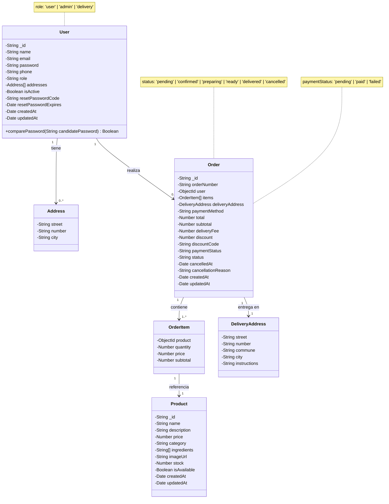

# Diagrama de Clases - Mr. Sandwich

## Diagrama UML



## Descripción de las Clases

### 1. User (Usuario)
**Responsabilidad:** Gestionar la información de los usuarios del sistema.

**Atributos:**
- `_id`: Identificador único del usuario
- `name`: Nombre completo del usuario
- `email`: Correo electrónico (único)
- `password`: Contraseña hasheada
- `phone`: Teléfono de contacto
- `role`: Rol del usuario (user, admin, delivery)
- `addresses[]`: Lista de direcciones guardadas
- `isActive`: Estado de la cuenta
- `resetPasswordCode`: Código para recuperación de contraseña
- `resetPasswordExpires`: Fecha de expiración del código
- `createdAt`: Fecha de creación
- `updatedAt`: Fecha de última actualización

**Métodos:**
- `comparePassword(candidatePassword)`: Compara la contraseña ingresada con la hasheada

**Relaciones:**
- Tiene 0 o más direcciones (Address)
- Realiza 0 o más pedidos (Order)

---

### 2. Address (Dirección)
**Responsabilidad:** Almacenar información de direcciones del usuario.

**Atributos:**
- `street`: Nombre de la calle
- `number`: Número de dirección
- `city`: Ciudad

**Relaciones:**
- Pertenece a un Usuario (User)

---

### 3. Product (Producto)
**Responsabilidad:** Representar los productos del catálogo.

**Atributos:**
- `_id`: Identificador único del producto
- `name`: Nombre del producto
- `description`: Descripción detallada
- `price`: Precio del producto
- `category`: Categoría (clásicos, pollo, bebida, etc.)
- `ingredients[]`: Lista de ingredientes
- `imageUrl`: URL de la imagen
- `stock`: Cantidad disponible
- `isAvailable`: Disponibilidad para venta
- `createdAt`: Fecha de creación
- `updatedAt`: Fecha de última actualización

**Relaciones:**
- Es referenciado por OrderItem

---

### 4. Order (Pedido)
**Responsabilidad:** Gestionar información de pedidos realizados.

**Atributos:**
- `_id`: Identificador único del pedido
- `orderNumber`: Número de pedido único (formato: ORD-YYYYMMDD-XXXX)
- `user`: Referencia al usuario que realizó el pedido
- `items[]`: Lista de productos ordenados
- `deliveryAddress`: Dirección de entrega
- `paymentMethod`: Método de pago
- `total`: Total del pedido
- `subtotal`: Subtotal sin delivery
- `deliveryFee`: Costo de envío (default: 2990)
- `discount`: Descuento aplicado
- `discountCode`: Código de descuento usado
- `paymentStatus`: Estado del pago (pending, paid, failed)
- `status`: Estado del pedido (pending, confirmed, preparing, ready, delivered, cancelled)
- `cancelledAt`: Fecha de cancelación
- `cancellationReason`: Motivo de cancelación
- `createdAt`: Fecha de creación
- `updatedAt`: Fecha de última actualización

**Relaciones:**
- Pertenece a un Usuario (User)
- Contiene 1 o más ítems (OrderItem)
- Tiene una dirección de entrega (DeliveryAddress)

---

### 5. OrderItem (Item del Pedido)
**Responsabilidad:** Representar cada producto dentro de un pedido.

**Atributos:**
- `product`: Referencia al producto
- `quantity`: Cantidad ordenada
- `price`: Precio unitario al momento del pedido
- `subtotal`: Subtotal del item (quantity × price)

**Relaciones:**
- Pertenece a un Pedido (Order)
- Referencia a un Producto (Product)

---

### 6. DeliveryAddress (Dirección de Entrega)
**Responsabilidad:** Almacenar la dirección de entrega de un pedido específico.

**Atributos:**
- `street`: Calle
- `number`: Número
- `commune`: Comuna
- `city`: Ciudad
- `instructions`: Instrucciones adicionales de entrega

**Relaciones:**
- Pertenece a un Pedido (Order)

---

## Patrones de Diseño Implementados

### 1. **Repository Pattern**
Los modelos de Mongoose actúan como repositorios, encapsulando el acceso a datos.

### 2. **Data Transfer Object (DTO)**
Los controladores transforman los modelos en objetos JSON limitando la información sensible.

### 3. **Middleware Pattern**
- Hash de contraseñas antes de guardar
- Actualización automática de timestamps

### 4. **Factory Pattern**
Generación de números de orden únicos mediante función generadora.

---

## Notas de Implementación

### Validaciones
- **User.email**: Único, formato email válido
- **User.password**: Mínimo 6 caracteres
- **Product.price**: Número positivo requerido
- **Order.orderNumber**: Único, generado automáticamente

### Índices
- `User.email`: Índice único
- `Order.orderNumber`: Índice único
- `Order.user`: Índice para consultas por usuario

### Seguridad
- Contraseñas hasheadas con bcrypt (10 rounds)
- Tokens JWT para autenticación
- Roles para autorización

### Reglas de Negocio
1. Un pedido debe tener al menos 1 item
2. El delivery fee es fijo en $2.990
3. Los pedidos cancelados guardan fecha y razón
4. Los productos pueden estar inactivos pero mantienen su información
5. Las direcciones de entrega se copian al pedido (no se referencian) para mantener historial

---

## Diagrama de Relaciones Simplificado

```
User (1) ─────< Order (N)
  │                │
  │                ├─── (1) DeliveryAddress
  │                │
  └─< Address (N)  └───< OrderItem (N)
                           │
                           └───> Product (1)
```

**Cardinalidades:**
- Un User puede tener muchas Address
- Un User puede tener muchos Order
- Un Order contiene muchos OrderItem
- Un OrderItem referencia un Product
- Un Order tiene una DeliveryAddress
